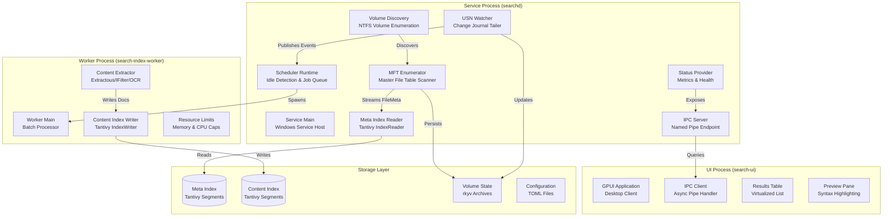
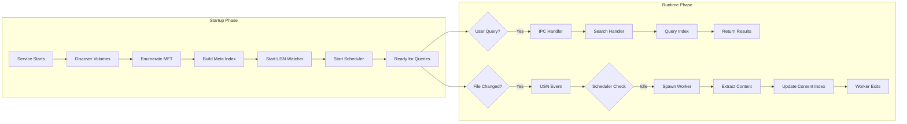
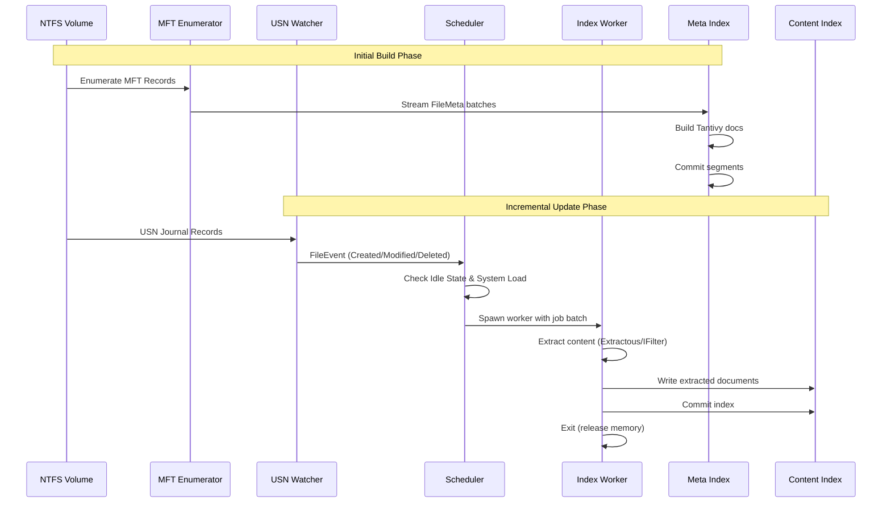
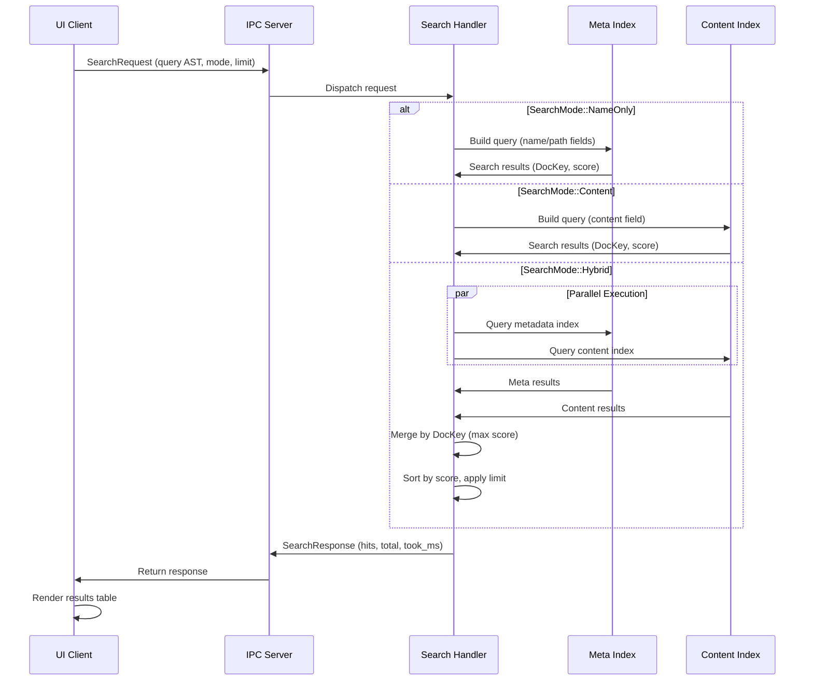
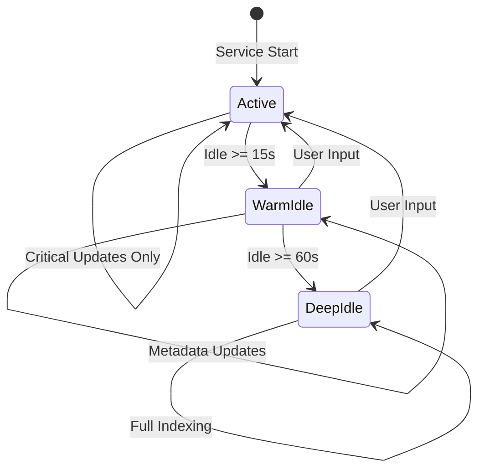

# UltraSearch

[](https://www.rust-lang.org/)
[](LICENSE)
[](https://github.com/Dicklesworthstone/ultrasearch)
[](https://doc.rust-lang.org/edition-guide/rust-2024/index.html)

> **UltraSearch is a high‑performance, memory‑efficient desktop search engine for Windows.**
> It combines NTFS MFT enumeration (Everything‑style instant filename search) with full‑text content indexing, all in Rust, with a multi‑process architecture that keeps the always‑on service tiny while isolating heavy work in short‑lived worker processes.

---

## TL;DR – What it is, why it’s great, and why you’d use it

**What it is**

* A **Windows desktop search stack**: background service + indexing workers + GPU‑accelerated UI.
* **Filename search** is Everything‑fast, backed by NTFS MFT enumeration and USN journal tailing.
* **Content search** is full‑text over extracted file contents using Tantivy, with Extractous/IFilter/OCR backends.

**Why it’s great**

* **Instant filename search** even on millions of files (MFT + USN; no recursive crawlers).
* **Deep content search** with proper full‑text indexing instead of “grep‑style” one‑offs.
* **Tiny idle footprint**: the service runs in **tens of MB** instead of hundreds.
* **Background‑respectful**: content indexing only when the machine is truly idle and not under load.
* **Transparent internals**: status/metrics APIs, structured logs, and clear scheduler behavior.

**Why not just use Windows Search / Everything / yet another crawler?**

* **Windows Search**

  * * Good coverage and content indexing.
  * – Slow initial builds, opaque state, heavy resident memory, intrusive background activity.
* **Everything**

  * * Fantastic filename search via the USN journal and MFT.
  * – No content indexing at all.
* **Typical recursive crawlers**

  * – Walk directory trees, opening handles and reading metadata one directory at a time.
  * – Scale poorly with depth and can’t fully exploit NTFS internals.

**UltraSearch goal:**
Combine **Everything‑style filename speed** with **Windows Search‑style content coverage**, but with a **service that behaves like a well‑designed daemon** (low memory, cooperative background behavior, strong observability) instead of a monolithic desktop app.

---

## Quickstart for Windows Users

This section is for people who just want to install and use UltraSearch. The rest of the README is a deep architectural dive.

### 1. Download the installer

> **Download (Windows)**
> Get the latest UltraSearch installer from the Releases page:
> **[https://github.com/Dicklesworthstone/ultrasearch/releases/latest](https://github.com/Dicklesworthstone/ultrasearch/releases/latest)**

When releases are published, you’ll see a `.exe` installer asset there. Download that file (e.g. `UltraSearch-Setup-x.y.z.exe`).

### 2. Install

1. Double‑click the downloaded installer.
2. Follow the on‑screen prompts:

   * Install the **UltraSearch Service** (runs in the background).
   * Install the **UltraSearch UI** (start menu + tray).
3. The installer will:

   * Register the Windows service.
   * Create start menu entries.
   * Optionally configure **“Start with Windows”** for the UI tray app.

### 3. Launch and search

Once installation completes:

1. Start the UI:

   * From the Start menu (`UltraSearch`), or
   * From the system tray (if auto‑start enabled).
2. Trigger Spotlight‑style search with **`Alt+Space`**:

   * A floating palette appears.
   * Type to search filenames and, once indexing is ready, content.
3. Hit **Enter** to open the selected file/folder, or use context actions from the result row.

### 4. Background indexing (what to expect)

* **Initial metadata build** runs quickly using direct MFT enumeration.
* **Content indexing** runs **only when the system is idle and not busy**:

  * Short‑lived worker processes extract and index content.
  * The always‑on service remains small and responsive.

### 5. Uninstall

Use standard Windows mechanisms:

* **Settings → Apps → Installed apps → UltraSearch → Uninstall**, or
* **Control Panel → Programs → Programs and Features → UltraSearch → Uninstall**

The uninstaller removes the service, UI, and associated program files. Index/state directories under `%PROGRAMDATA%\UltraSearch` may be preserved for faster re‑installs, depending on installer options.

---

## What’s new – UI / UX Highlights

Recent UI/UX work focuses on making UltraSearch feel like a modern, lightweight desktop companion rather than “a big app you sometimes open”.

* **Spotlight‑style Quick Search (`Alt+Space`)**

  * Floating palette with:

    * **Search‑as‑you‑type** filename search via the meta index.
    * Inline **query highlighting** in results.
    * **Recent history** surfaced for quick re‑runs.
  * Fully keyboard‑driven: arrows to navigate, Enter to open, Esc to dismiss.

* **Keyboard shortcuts overlay / Help panel (`F1`, `Ctrl+/`, `Cmd+/`)**

  * Shows a grouped cheatsheet of global + in‑app shortcuts.
  * Includes tray / update tips and power‑user tricks.
  * Accessible both via shortcuts **and** a header “Help” chip in the UI.
  * Dismissible via Esc or clicking outside.

* **Tray awareness**

  * Tray tooltip reflects **Idle / Indexing / Update available / Offline**.
  * Update panel supports:

    * Opt‑in update checks.
    * Check → download → restart flow.
    * Release notes surfaced inline.

* **GraalVM guard for Extractous**

  * `content-extractor`’s `build.rs` enforces **GraalVM CE 23.x** when the `extractous_backend` feature is enabled.
  * Setup details live in `docs/GRAALVM_SETUP.md`.

* **IPC self‑healing**

  * Named‑pipe client uses **retry with backoff**.
  * Handles:

    * Service restarts.
    * Temporary pipe‑busy states.
    * Connection races during boot / upgrade.

* **Status metrics**

  * Queue depth, active workers, content jobs enqueued/dropped are surfaced via status/metrics responses.
  * The UI and external tools can query these to show progress and diagnose issues.

For a concise feature overview with links to docs and setup instructions, see **`docs/FEATURES.md`**.

---

## Why UltraSearch’s architecture looks “over‑engineered”

Most desktop search tools are monolithic: one big process that discovers files, indexes them, extracts content, answers queries, and renders UI. UltraSearch deliberately **splits** this into specialized pieces:

* A tiny **Windows service** that:

  * Enumerates NTFS MFTs and tails USN journals.
  * Maintains the metadata index for instant filename search.
  * Manages scheduling and job queues.
* Short‑lived **worker processes** that:

  * Extract content with Extractous/IFilter/OCR.
  * Write to the content index.
  * Exit immediately after committing, releasing all heavy allocations.
* A GPU‑accelerated **UI process** that:

  * Speaks to the service over named pipes.
  * Renders virtualized result lists and previews.
  * Provides a modern, responsive UX.

The design goal: **service stays tiny and predictable**, while heavy work is **isolated, bounded, and disposable**.

---

## 1. Problem Space and High‑Level Approach

### 1.1 The problem space

Desktop search tools have historically forced a choice between **speed** and **completeness**.

**Windows Search** (built‑in indexing) offers comprehensive content coverage but has issues:

* Slow initial index builds (hours or days on large filesystems).
* High idle memory usage (hundreds of MB resident).
* Background activity that can visibly affect system responsiveness.
* Opaque indexing state; debugging “why didn’t it find X?” is hard.
* Limited query expressiveness and ranking control.

**Everything** shows that instant filename search is possible:

* Sub‑10ms latency for filename queries even on millions of files.
* Very low memory footprint (tens of MB).
* Real‑time change detection via the USN journal.

…but it **intentionally doesn’t do content indexing**.

Many “custom search” tools rely on **recursive directory crawlers**:

* Walk directory trees using `FindFirstFile`/`FindNextFile`.
* Cannot exploit NTFS’s centralized MFT structure.
* Miss files inaccessible via standard directory APIs.
* Scale poorly: complexity proportional to directory depth and breadth.

### 1.2 UltraSearch’s approach in one page

UltraSearch bridges these gaps by designing for **NTFS and Windows specifically**, rather than pretending all filesystems are the same:

1. **NTFS‑native indexing**

   * Direct MFT enumeration (via `usn-journal-rs`) instead of recursive traversal.
   * Achieves **100k–1M files/sec** enumeration on modern SSDs.
2. **Process isolation**

   * Heavy content extraction and indexing occur in short‑lived worker processes.
   * Workers exit after finishing a batch, returning the system to a minimal baseline.
3. **Unified search engine**

   * Both metadata and content indices are powered by **Tantivy**, a Rust search engine.
   * Consistent scoring, query expressiveness, and field semantics across modes.
4. **Intelligent scheduling**

   * Background indexing respects **user idle time and system load**.
   * Content jobs only run when the machine can spare the resources.
5. **Memory efficiency**

   * Memory‑mapped Tantivy segments.
   * Zero‑copy serialization for state.
   * Bounded allocations for writers and extractors.

Result: **Everything‑style speed for filenames** plus **full‑text content search**, with a background service that behaves like a good citizen.

---

## 2. Architecture Overview

UltraSearch uses a **multi‑process architecture**: one service, many short‑lived workers, plus a UI process.

### 2.1 Processes at a glance

The diagram below shows the major processes and their responsibilities.



Key points:

* The **service** owns all NTFS handles, indexing decisions, and the metadata index.
* **Workers** are spun up and torn down by the scheduler to process content jobs.
* The **UI** talks only to the service via IPC; it never touches the filesystem directly for search.

### 2.2 Startup vs runtime behavior

This diagram separates the initial bootstrapping from normal operation.



* Startup: full MFT enumeration + metadata index build, USN watcher, scheduler.
* Runtime:

  * Queries are handled immediately using the metadata/content indices.
  * File system changes stream in via USN; scheduler decides when to spawn workers.

### 2.3 Indexing pipeline (data flow)



The **metadata index** is built in a single streaming pass over the MFT; the **content index** is incrementally updated based on USN change events and the scheduler’s decisions.

### 2.4 Query execution flow



Modes:

* **NameOnly** – Everything‑style filename search via the metadata index.
* **Content** – pure full‑text search via the content index.
* **Hybrid** – merge of both, with score fusion by `DocKey`.

### 2.5 Scheduler state machine



* **Active** – user interacting: only cheap, critical updates.
* **WarmIdle** – short idle: metadata maintenance allowed.
* **DeepIdle** – sustained idle: full content indexing allowed, subject to system load constraints.

---

## 3. Core Data Model

UltraSearch’s data model is designed around **efficient storage**, **fast queries**, and **stable correlation** between metadata and content indices.

### 3.1 Identifier system

Identifiers are chosen to align with NTFS and to pack efficiently into 64‑bit keys.

#### VolumeId (u16)

A small integer assigned at runtime that maps to NTFS volume GUIDs and drive letters.

```
┌─────────────────────────────────────────────────────────┐
│ VolumeId: u16                                           │
├─────────────────────────────────────────────────────────┤
│ Range:      0..65535                                   │
│ Assignment: Sequential at service startup              │
│ Persistence: Stored in volume state files              │
│ Use Cases: Per-volume filtering, isolation             │
└─────────────────────────────────────────────────────────┘
```

**Design rationale**

* 16 bits → 65,535 possible volumes, far beyond practical needs.
* Tiny type → efficient packing into composite keys.
* Sequential assignment → simple volume bookkeeping.
* Runtime assignment → supports dynamic volume discovery.

#### FileId (u64)

The 64‑bit NTFS File Reference Number (FRN) from the MFT.

```
┌─────────────────────────────────────────────────────────┐
│ FileId: u64                                             │
├─────────────────────────────────────────────────────────┤
│ Bits 0-47:  File Reference Number (FRN)                 │
│ Bits 48-63: Sequence Number                             │
│ Stability: Persists across renames (same volume)        │
│ Detection: Sequence number detects stale references     │
└─────────────────────────────────────────────────────────┘
```

**Design rationale**

* FRN is NTFS’s native file identifier; it directly indexes into the MFT.
* Sequence number lets us detect deleted or reused entries.
* 48‑bit FRN supports absurdly many files per volume (281T theoretical, ~4B practical).
* Stable across renames → index updates don’t require path walks.

#### DocKey (u64)

A composite key encoding `(VolumeId, FileId)` into a single 64‑bit value.

```
┌─────────────────────────────────────────────────────────┐
│ DocKey: u64                                             │
├─────────────────────────────────────────────────────────┤
│ Bits 0-47:  FileId (FRN + sequence)                     │
│ Bits 48-63: VolumeId                                    │
│ Format:     "{volume}:0x{frn_hex}" for debugging        │
│ Use:        Primary key for all index operations        │
└─────────────────────────────────────────────────────────┘
```

**Implementation**

```rust
impl DocKey {
    pub const fn from_parts(volume: VolumeId, file: FileId) -> Self {
        let packed = ((volume as u64) << 48) | (file & 0x0000_FFFF_FFFF_FFFF);
        DocKey(packed)
    }
    
    pub const fn into_parts(self) -> (VolumeId, FileId) {
        let volume = (self.0 >> 48) as VolumeId;
        let file = self.0 & 0x0000_FFFF_FFFF_FFFF;
        (volume, file)
    }
}
```

**Design rationale**

* Single 64‑bit key → efficient storage, comparison, and hashing.
* Facilitates fast field filters in Tantivy (e.g. per‑volume filtering).
* Human‑readable formatting helps debugging/logging.
* Enables range queries scoped to volume ranges.

**Trade‑offs considered**

* **Separate fields** – more storage and more complex queries. Rejected.
* **String keys** – huge memory and comparison overhead. Rejected.
* **128‑bit UUIDs** – bigger and lose volume locality. Rejected.

### 3.2 Document types

UltraSearch maintains **two indices**:

* **Metadata index** (for filenames and attributes).
* **Content index** (for full‑text content).

Each has its own schema and update cadence.

#### 3.2.1 Metadata documents (meta‑index)

Optimized for filename and attribute queries with minimal storage overhead.

```
┌─────────────────────────────────────────────────────────┐
│ Metadata Document Schema                                │
├─────────────────────────────────────────────────────────┤
│ doc_key:    u64  FAST + STORED  Primary key             │
│ volume:     u16  FAST           Per-volume filtering    │
│ name:       TEXT Indexed        Filename search         │
│ path:       TEXT Indexed        Path search             │
│ ext:        STRING FAST         Extension filter        │
│ size:       u64  FAST           Size range queries      │
│ created:    i64  FAST           Creation time           │
│ modified:   i64  FAST           Modification time       │
│ flags:      u64  FAST           Attribute bitfield      │
└─────────────────────────────────────────────────────────┘
```

**Field details**

* `doc_key` – primary key; FAST field for efficient deletes/updates and filtering.
* `volume` – FAST field for per‑volume scoping.
* `name`

  * Tokenized on `[\ / . - _]`.
  * Supports partial and prefix matches on filenames.
* `path`

  * Tokenized on directory separators.
  * Optional because path can be reconstructed, but useful for ranking/snippets.
* `ext`

  * STRING + FAST for exact extension filters (`ext:pdf`, `ext:rs`).
* `size`

  * `u64` for size range queries up to multi‑exabyte files.
* `created` / `modified`

  * Unix timestamps; FAST fields for range filters (e.g. “modified last 7 days”).
* `flags`

  * Bitfield encoding attributes like:

    * `IS_DIR`, `HIDDEN`, `SYSTEM`, `ARCHIVE`, `REPARSE`, `OFFLINE`, `TEMPORARY`.

**Typical document size**

* ~100–500 bytes per file (path length dominates).

**Update frequency**

* Updated **immediately** on file system changes via the USN journal.

#### 3.2.2 Content documents (content‑index)

Full‑text content extracted from files, updated only in background.

```
┌─────────────────────────────────────────────────────────┐
│ Content Document Schema                                 │
├─────────────────────────────────────────────────────────┤
│ doc_key:      u64  FAST + STORED  Correlates with meta │
│ volume:       u16  FAST           Per-volume filtering  │
│ name:         TEXT Indexed        Name boost            │
│ path:         TEXT STORED         Snippet context       │
│ ext:          STRING FAST         Format filter         │
│ size:         u64  FAST           Size filter           │
│ modified:     i64  FAST           Recency boost         │
│ content_lang: STRING STORED       Analyzer selection    │
│ content:      TEXT Indexed        Full-text search      │
└─────────────────────────────────────────────────────────┘
```

**Field details**

* `doc_key` – correlation key to metadata index.
* `content` – main full‑text field, with language‑appropriate analyzer.
* `content_lang` – ISO‑639‑1 language code; used to pick analyzers.
* `name` / `path` – used to boost ranking for filename/path matches.

**Typical document size**

* Varies widely; content truncated at configurable limits (~16–32 MiB, ~100–200k chars).

**Update frequency**

* Only during **background indexing**, when the scheduler decides conditions are safe.

### 3.3 Why two separate indices?

This is one of the key design decisions.

**Alternative 1 – single unified index**

* Pros:

  * Single index, single query path.
* Cons:

  * Content updates touch a large index.
  * Service must keep content reader open (higher memory baseline).
  * Can’t “turn off” content indexing without impacting metadata.
* Verdict: **Rejected** due to mismatched update patterns and memory impact.

**Alternative 2 – three indices (meta, content, combined)**

* Pros:

  * Flexible routing/optimizations.
* Cons:

  * Data duplication and higher storage cost.
  * Consistency challenges across three indices.
  * Complex update logic.
* Verdict: **Rejected** as over‑complex.

**Chosen approach – two separate indices**

Benefits:

1. **Update frequency mismatch**

   * Metadata changes often (renames, moves, flags).
   * Content changes less often; sometimes never.
   * Separate indices let us update metadata cheaply without touching content.

2. **Query patterns**

   * Filename searches are much more common than content searches.
   * A lean metadata index keeps common queries extremely fast.

3. **Memory footprint**

   * Service can operate with only the meta index loaded by default.
   * Content index readers are opened lazily as needed.

4. **Indexing strategy**

   * Metadata indexing is cheap and can run in the service.
   * Content extraction is heavy and moved into worker processes.

5. **Failure isolation**

   * Content index issues don’t impair filename search.
   * Rebuilding content index doesn’t require touching metadata.

Trade‑offs:

* **Result merging** – hybrid queries must merge results from two indices (by `DocKey`).
* **Consistency** – two stores can diverge; mitigated by `DocKey` as the single source of truth and atomic per‑index updates.

---

## 4. Deep NTFS Integration

UltraSearch is deeply NTFS‑specific by design.

### 4.1 Volume discovery

At service startup (and when volumes change), UltraSearch discovers NTFS volumes.

**Simplified algorithm**

```rust
// Pseudocode, not exact implementation:

1. GetLogicalDrives() → bitmask of drive letters
2. For each drive letter:
   a. GetVolumeInformationW() → filesystem type
   b. Filter to "NTFS"
   c. GetVolumeNameForVolumeMountPointW() → volume GUID path
   d. Track mapping: drive letters ↔ GUID
3. Assign VolumeId sequentially
4. Persist mapping in volume state files
```

**Volume GUID paths vs drive letters**

UltraSearch uses **volume GUID paths** like `\\?\Volume{GUID}\` instead of `C:\`:

* **Stable** across reboots and letter reassignments.
* Support **mount points** where multiple letters map to a single volume.
* Volumes may exist **without any drive letter**.
* GUIDs are globally unique.

Example:

```text
VolumeId:      1
GUID Path:     \\?\Volume{12345678-1234-1234-1234-123456789abc}\
Drive Letters: ["C:", "D:"]
```

### 4.2 MFT enumeration

The MFT is NTFS’s global table of file records. UltraSearch enumerates it directly via `usn-journal-rs`.

**Highly simplified MFT record layout**

```
┌─────────────────────────────────────────────────────────┐
│ MFT Record (≈1024 bytes)                               │
├─────────────────────────────────────────────────────────┤
│ Header: Record number, sequence, flags                  │
│ Attributes:                                             │
│   - $STANDARD_INFORMATION: timestamps, attributes       │
│   - $FILE_NAME: filename, parent FRN                    │
│   - $DATA: file data / streams                          │
│   - $BITMAP: allocation info                            │
└─────────────────────────────────────────────────────────┘
```

**Enumeration steps**

1. Open a volume handle:

   ```rust
   CreateFileW(
       volume_guid_path,
       FILE_READ_ATTRIBUTES | FILE_READ_DATA | FILE_LIST_DIRECTORY,
       FILE_SHARE_READ | FILE_SHARE_WRITE | FILE_SHARE_DELETE,
       ...
   )
   ```

2. Use `usn-journal-rs` to iterate MFT records:

   * Extract FRN, parent FRN.
   * Read file name, flags, size, timestamps.
   * Filter out system/inaccessible entries per configuration.
   * Resolve FRN→path via parent graph with a small LRU cache.

3. Stream `FileMeta` into the metadata index builder:

   * No “whole filesystem in memory” structure.
   * Periodic commits (e.g. every 100k docs or 30s).

**Performance characteristics**

* **Enumeration rate**: ~100k–1M files/sec (disk‑dependent).
* **Memory usage**: low; the design is fully streaming.
* **Path resolution**: assisted by `usn-journal-rs` helpers + LRU cache.

**Why MFT enumeration instead of directory traversal?**

| Approach                | Complexity   | Speed     | Coverage                            | Memory         |
| ----------------------- | ------------ | --------- | ----------------------------------- | -------------- |
| **MFT enumeration**     | O(n files)   | 100k–1M/s | Complete (even system/inaccessible) | Very low       |
| **Directory traversal** | O(n × depth) | 1k–10k/s  | Incomplete (miss hidden/system)     | Higher (trees) |

* MFT access is **designed** for exactly this type of global scan.
* Directory walkers are convenient but fundamentally limited.

### 4.3 USN journal tailing

The USN Change Journal is NTFS’s append‑only record of filesystem changes. UltraSearch tails it per volume.

**Journal metadata (simplified)**

```
┌─────────────────────────────────────────────────────────┐
│ USN Journal Data                                        │
├─────────────────────────────────────────────────────────┤
│ UsnJournalID:     unique journal ID                     │
│ FirstUsn:         oldest record                         │
│ NextUsn:          next USN to be assigned               │
│ LowestValidUsn:   oldest valid record                   │
│ MaxUsn:           maximum possible USN                  │
└─────────────────────────────────────────────────────────┘
```

**Architecture**

* One **watcher thread per volume** in the service.
* Uses `FSCTL_QUERY_USN_JOURNAL` / `FSCTL_READ_USN_JOURNAL` via `usn-journal-rs`.
* Stores `(journal_id, last_usn)` per volume in `VolumeState`.

**Event model**

```rust
pub enum FileEvent {
    Created  { usn: u64, frn: u64, name: String, parent_frn: u64 },
    Deleted  { usn: u64, frn: u64 },
    Modified { usn: u64, frn: u64 },
    Renamed  { usn: u64, frn: u64, old_name: String, new_name: String, parent_frn: u64 },
    BasicInfoChanged { usn: u64, frn: u64 }, // attrs, timestamps, ACLs
}
```

**Handling journal gaps**

On startup, UltraSearch compares persisted state to current journal:

* If `journal_id` changed → journal recreated (e.g. volume reformat).
* If `last_usn` is outside `[FirstUsn, NextUsn]` → journal wrapped.
* In both cases, volume is marked **stale** and scheduled for **incremental rescan**.

**Why USN instead of `ReadDirectoryChangesW`?**

| Feature               | USN Journal       | ReadDirectoryChangesW                  |
| --------------------- | ----------------- | -------------------------------------- |
| Completeness          | Total history     | Can lose events (buffer overflow)      |
| Persistence           | Survives reboot   | Volatile                               |
| Handles               | Single per volume | One per watched directory tree         |
| Missed events on down | Recoverable       | Permanently lost                       |
| High change rates     | Robust            | Buffer overflow, dropped notifications |

USN is simply the **correct primitive** for robust incremental indexing.

---

## 5. Search Engine and Indexing Architecture

UltraSearch uses **Tantivy 0.24.x** as its search engine, chosen after comparing Rust and non‑Rust alternatives.

### 5.1 Why Tantivy?

Comparison snapshot:

| Engine      | Language | Performance | Memory    | Rust integration | Notes               |
| ----------- | -------- | ----------- | --------- | ---------------- | ------------------- |
| **Tantivy** | Rust     | Excellent   | Efficient | Native           | Actively maintained |
| Lucene      | Java     | Excellent   | Higher    | FFI required     | De‑facto standard   |
| Bleve       | Go       | Good        | Moderate  | FFI required     | Mature Go option    |
| Meilisearch | Rust     | Good        | Higher    | Native           | Bundled server      |

Decision factors:

1. **Rust‑native implementation**

   * No FFI boundary, single toolchain, shared ecosystem.
2. **Performance**

   * Competitive with Lucene in many workloads.
3. **Memory efficiency**

   * CompactDoc format is well‑suited to large indices.
4. **Feature set**

   * Fast fields, scoring models, analyzers, and range queries.
5. **Active maintenance**

   * Modern Rust style; regularly updated.

### 5.2 Tantivy schemas

Both indices use CompactDoc+fast fields aggressively.

#### 5.2.1 Metadata index schema (recap)

```rust
doc_key:  u64   // FAST | STORED
volume:   u16   // FAST
name:     TEXT  // custom tokenizer for filenames
path:     TEXT  // optional, tokenized by separators
ext:      STRING // FAST
size:     u64   // FAST
created:  i64   // FAST
modified: i64   // FAST
flags:    u64   // FAST
```

**Field types**

* **FAST** – columnar storage; used heavily for filters and range queries.
* **STORED** – retrievable fields, not indexed; mostly for IDs.
* **TEXT** – tokenized, full‑text searchable.
* **STRING** – raw keyword, exact match.

**Filename tokenization**

Example:

```text
Input:   "my-document_v2.final.pdf"
Tokens:  ["my", "document", "v2", "final", "pdf", "my-document_v2.final.pdf"]
```

This supports:

* Prefix and partial matches (`"doc"` matches `"document"`).
* Whole‑filename queries (last token).
* Better recall without bloating the index.

#### 5.2.2 Content index schema (recap)

```rust
doc_key:      u64    // FAST | STORED
volume:       u16    // FAST
name:         TEXT   // boosts ranking
path:         TEXT   // stored; snippet context
ext:          STRING // FAST
size:         u64    // FAST
modified:     i64    // FAST
content_lang: STRING // stored
content:      TEXT   // main full-text field
```

**Analyzers**

* Default: English analyzer (tokenization + stopwords + stemming).
* Future: per‑language analyzers based on `content_lang`.
* Further future: document‑type‑aware analyzers (code, logs, etc.).

### 5.3 Memory management

The indexing stack is engineered to keep memory usage predictable and low.

#### 5.3.1 Memory‑mapped storage

Tantivy segments and certain state blobs use `memmap2`:

```rust
use memmap2::{Mmap, MmapOptions};
use std::fs::File;

pub struct MappedIndex {
    mmap: Mmap,
    // ...
}

impl MappedIndex {
    pub fn from_file(path: &Path) -> Result<Self> {
        let file = File::open(path)?;
        let mmap = unsafe { MmapOptions::new().map(&file)? };
        Ok(Self { mmap })
    }
}
```

Benefits:

* OS‑level page cache decides what stays resident.
* Zero‑copy reads.
* Memory usage scales with **working set**, not total index size.
* Natural behavior under memory pressure.

#### 5.3.2 Zero‑copy serialization with `rkyv`

Volume state and snapshots are stored using `rkyv`:

```rust
use rkyv::{Archive, Deserialize, Serialize};

#[derive(Archive, Serialize, Deserialize)]
pub struct VolumeState {
    pub volume_id: VolumeId,
    pub last_usn: u64,
    pub journal_id: u64,
    // ...
}

// Serialize
let bytes = rkyv::to_bytes::<_, 256>(&state)?;

// Zero-copy read
let archived = unsafe { rkyv::archived_root::<VolumeState>(&bytes[..]) };
```

Characteristics:

* 2–5x smaller than JSON.
* 10–100x faster to deserialize.
* Zero‑copy reads (no reallocation).

#### 5.3.3 Index writer isolation

The **content index writer** lives **only in the worker process**:

```rust
let writer_config = WriterConfig {
    heap_size: 64 * 1024 * 1024, // 64 MB
    num_threads: 2,
    // ...
};
let writer = index.writer_with_config(writer_config)?;
```

Benefits:

* Worker exit ⇒ all writer allocations vanish.
* Bound per‑worker memory via `heap_size`.
* Multiple workers can run without starving the system.

Trade‑off: more frequent commits/merges, but far more predictable memory behavior.

#### 5.3.4 Reader configuration in the service

The service maintains **lightweight readers**:

```rust
let reader = index
    .reader_builder()
    .reload_policy(ReloadPolicy::Manual)
    .num_warmers(0)
    .docstore_cache_size(10 * 1024 * 1024)
    .build()?;
```

Rationale:

* **Manual reload** – avoid automatic reload storms; service explicitly reloads on commits.
* **Zero warmers** – minimal overhead at startup; rely on OS cache.
* **Small docstore cache** – keep reader memory small and rely on mmap.

### 5.4 Writer tuning per index

#### Metadata index writer (initial build / rebuild)

```rust
WriterConfig {
    heap_size: 512 * 1024 * 1024,     // up to 512 MB
    num_threads: min(8, num_cpus()),
    merge_policy: LogMergePolicy {
        target_segment_size: 256 * 1024 * 1024,
        max_merged_segment_size: 1024 * 1024 * 1024,
    },
}
```

* Aggressively parallelized and memory‑heavy **only during initial build**.
* Large segments reduce merge overhead later.

#### Content index writer (worker processes)

```rust
WriterConfig {
    heap_size: 64 * 1024 * 1024,      // 64–256 MB configurable
    num_threads: 2,                   // small, predictable
    merge_policy: LogMergePolicy {
        target_segment_size: 128 * 1024 * 1024,
        max_merged_segment_size: 256 * 1024 * 1024,
    },
}
```

Why bounded heap?

* Prevents a single worker from blowing up memory.
* Supports multiple concurrent workers safely.
* Makes worst‑case behavior more predictable.

---

## 6. Content Extraction Stack

UltraSearch’s content extractor stack is designed to be **pluggable**, **ordered**, and **resource‑bounded**.

### 6.1 Extractor architecture

Core traits:

```rust
pub trait Extractor: Send + Sync {
    fn name(&self) -> &'static str;
    fn supports(&self, ctx: &ExtractContext) -> bool;
    fn extract(&self, ctx: &ExtractContext, key: DocKey) -> Result<ExtractedContent>;
}

pub struct ExtractorStack {
    backends: Vec<Box<dyn Extractor + Send + Sync>>,
}
```

Flow:

1. Iterate `backends` in order.
2. First backend where `supports()` returns true handles the file.
3. If extraction fails, error bubbles up (no cross‑backend fallback cascade).
4. Return text, language hints, truncation flags, bytes processed.

Why ordered fallback?

* Try **cheaper/faster** extractors first (plain text, lightweight parsers).
* Reserve heavyweight Extractous/IFilter/OCR for when really needed.
* Let highly specific extractors win over more generic ones.

### 6.2 Extractous integration

Extractous is the primary backend; it exposes Apache Tika functionality via Rust.

**Supported families**

* Documents: `pdf`, `docx`, `xlsx`, `pptx`, `rtf`.
* Web/markup: `html`, `xml`, `xhtml`, `md`, `rst`.
* Archives: `zip` (with internal whitelist).
* Data: `csv`, `json`, `jsonl`.
* E‑books: `epub`.
* Misc: many generic text formats.

Usage sketch:

```rust
let engine = ExtractousEngine::new()
    .set_extract_string_max_length(max_chars as i32);

let (text, metadata) = engine.extract_file_to_string(path)?;
```

Why Extractous?

* Rust‑native: no separate Java runtime or FFI bridging.
* Tika‑level format coverage.
* Strong performance and memory characteristics vs Python/CLI‑based chains.

### 6.3 Optional IFilter COM integration

On Windows, system‑installed IFilters can be used for certain file types.

When:

* Extractous doesn’t support the format.
* A proprietary IFilter offers better fidelity (e.g., some Office variants).
* Users explicitly enable `ifilter` support.

Sketch:

```rust
#[cfg(windows)]
use windows::Win32::System::Com::{IPersistFile, IFilter};

pub struct IFilterExtractor { /* COM wrappers */ }

impl Extractor for IFilterExtractor {
    fn extract(&self, ctx: &ExtractContext, key: DocKey) -> Result<ExtractedContent> {
        let filter = LoadIFilter(ctx.path)?;
        // Iterate chunks via GetChunk/GetText...
        Ok(ExtractedContent { /* ... */ })
    }
}
```

Trade‑offs:

* Pros: leverages existing system filters.
* Cons: COM lifetime rules, STA threading, platform‑specific complexity.
* Exposed behind **feature flags**, not mandatory.

### 6.4 OCR integration

For image‑only PDFs or actual image files, UltraSearch can optionally use Tesseract OCR.

Strategy:

* Attempt normal extraction first.
* If result is empty/near‑empty but file type suggests a scan:

  * Run Tesseract for up to `ocr_max_pages`.
  * Merge recognized text into `content`.
  * Set `content_lang` based on OCR detection.

Sketch:

```rust
pub struct OCRExtractor {
    engine: TesseractEngine,
    max_pages: u64,
}

impl Extractor for OCRExtractor {
    fn extract(&self, ctx: &ExtractContext, key: DocKey) -> Result<ExtractedContent> {
        if self.is_image_only(ctx.path)? {
            let text = self.engine.extract_pages(ctx.path, self.max_pages)?;
            Ok(ExtractedContent {
                text,
                content_lang: Some(self.engine.detect_language(&text)?),
                // ...
            })
        } else {
            Err(ExtractError::Unsupported("not image-only".into()))
        }
    }
}
```

All OCR work is subject to global resource limits (see below).

### 6.5 Resource limits and streaming

To keep workers bounded:

* **Per‑document limits**

  * `max_bytes_per_file` (default: 16–32 MiB).
  * `max_chars_per_file` (default: 100–200k).
* **Behavior when exceeded**

  * Truncate on UTF‑8 boundaries.
  * Flag document as truncated.
* **Archive policies**

  * Only index whitelisted formats inside archives.
  * Cap recursion depth.
  * Skip encrypted archives.
* **Streaming**

  * Where possible, process data in streaming fashion rather than slurping everything into RAM.

Motivation:

* Prevent single pathological files from destabilizing workers.
* Make worst‑case memory usage predictable.
* Accept a controlled amount of truncation for massive files.

---

## 7. Scheduler and Background Execution

The scheduler decides **when** and **how much** work gets done, based on UI idle time and system load.

### 7.1 Idle detection

UltraSearch uses `GetLastInputInfo` to derive “how long since the last user input”.

Sketch:

```rust
pub struct IdleTracker {
    warm_idle: Duration,
    deep_idle: Duration,
    // ...
}

impl IdleTracker {
    pub fn sample(&mut self) -> IdleSample {
        let idle_for = self.get_idle_duration()?;
        let state = self.classify_idle(idle_for);
        IdleSample { state, idle_for, since_state_change }
    }
    
    fn get_idle_duration(&self) -> Option<Duration> {
        #[cfg(windows)]
        {
            let last_input = GetLastInputInfo()?;
            let now = GetTickCount64();
            Some(Duration::from_millis((now - last_input) as u64))
        }
    }
}
```

Default thresholds:

* `Active`: `< 15s`.
* `WarmIdle`: 15–60s.
* `DeepIdle`: `> 60s`.

These are **configurable**.

Alternative heuristics considered:

* Windows background mode (`PROCESS_MODE_BACKGROUND_BEGIN`): rejected due to aggressive working‑set trimming causing paging.
* CPU‑only heuristics: insufficient; user can be idle while other workloads are active.
* Screen savers: too coarse and not reliable in modern Windows.

### 7.2 System load sampling

The scheduler also samples system load (via `sysinfo` and Windows performance counters).

Example metrics:

```rust
pub struct SystemLoad {
    pub cpu_percent: f32,
    pub mem_used_percent: f32,
    pub disk_busy: bool,
    pub disk_bytes_per_sec: u64,
    pub sample_duration: Duration,
}
```

Typical thresholds:

* CPU < 20% → content indexing OK (in DeepIdle).
* CPU 20–50% → metadata‑only work.
* CPU > 50% → pause all heavy indexing.
* Disk busy flag based on measured `Disk Bytes/sec`.

Disk I/O sampling often uses PDH counters like `\\PhysicalDisk(_Total)\\Disk Bytes/sec`.

### 7.3 Job categories and priorities

Jobs are split into distinct queues with different policies.

**1. Critical updates (cheap)**

* Delete events, basic renames, attribute changes.
* Always processed, even in **Active** state.
* Sub‑millisecond per job.

**2. Metadata rebuilds (moderate)**

* Volume rescan after USN gap or journal reset.
* Directory subtree reindex after config change.
* Allowed in **WarmIdle+**.

**3. Content indexing (expensive)**

* New/changed files needing extraction.
* Allowed only in **DeepIdle** and low CPU/disk load.
* Per‑batch worker processes.

Scheduler tick:

```rust
pub async fn tick(&mut self) {
    let idle_sample = self.idle.sample();
    let load = self.load.sample();
    
    self.update_status(idle_sample, load);
    
    let allow_content = self.allow_content_jobs(idle_sample, load);
    
    if allow_content && !self.content_jobs.is_empty() {
        let batch = self.pop_batch(self.config.content_batch_size);
        self.spawn_worker(batch).await?;
    }
}
```

Why separate queues?

* Different **SLAs** per job type.
* Critical updates must not be starved by heavy jobs.
* Content jobs can be deferred without user‑visible regressions in filename search.

### 7.4 Process and thread priorities

**Service process**

* Runs at normal process priority.
* USN watcher and scheduler threads typically at `BELOW_NORMAL` thread priority.
* Avoids Windows background process mode due to aggressive working‑set clamping.

**Worker processes**

* Run at `IDLE` or `BELOW_NORMAL` priority.
* May adjust I/O priority per file handle.
* Can be placed in a job object to enforce limits.

Rationale: the service must stay responsive; workers are pure background.

---

## 8. IPC Protocol (Named Pipes)

UltraSearch uses **Windows named pipes** for IPC between the service, UI, and CLI.

### 8.1 Transport

* Named pipes via `tokio::net::windows::named_pipe` on the server side.
* Length‑prefixed messages: `[u32 length][payload bytes]`.
* Multiple concurrent client connections.

Why named pipes?

| Transport     | Latency | Overhead | Complexity | Local Windows support |
| ------------- | ------- | -------- | ---------- | --------------------- |
| Named pipes   | Low     | Low      | Simple     | First‑class           |
| TCP sockets   | Higher  | Higher   | Medium     | Good, but needs ports |
| Shared memory | Lowest  | Very low | Complex    | Manual protocols      |
| Temp files    | High    | High     | Simple     | Awkward for IPC       |

Named pipes are the **natural fit** for local Windows IPC: fast, well‑integrated, and firewall‑agnostic.

### 8.2 Message types

**SearchRequest**

```rust
pub struct SearchRequest {
    pub id: Uuid,
    pub query: QueryExpr,          // parsed AST
    pub limit: u32,
    pub mode: SearchMode,          // NameOnly, Content, Hybrid, Auto
    pub timeout: Option<Duration>,
    pub offset: u32,               // pagination offset
}
```

**SearchResponse**

```rust
pub struct SearchResponse {
    pub id: Uuid,                  // matches request
    pub hits: Vec<SearchHit>,
    pub total: u64,
    pub truncated: bool,
    pub took_ms: u32,
    pub served_by: Option<String>, // host identity for debugging
}
```

**Query AST**

```rust
pub enum QueryExpr {
    Term(TermExpr),
    Range(RangeExpr),
    Not(Box<QueryExpr>),
    And(Vec<QueryExpr>),
    Or(Vec<QueryExpr>),
}

pub struct TermExpr {
    pub field: Option<FieldKind>,  // name, path, ext, content, etc.
    pub value: String,
    pub modifier: TermModifier,    // prefix, fuzzy, etc.
}
```

Serialization:

* Uses `bincode` for a compact binary representation.
* Typical payload sizes:

  * Requests: ~100–500 bytes.
  * Responses: ~1–10 KB (depends on `limit` and snippet sizes).

### 8.3 Concurrency model

**Service side**

* Accepts multiple named pipe connections.
* One async task per client.
* Each task:

  * Reads length‑prefixed messages.
  * Executes queries against Tantivy readers.
  * Writes responses back.

**UI side**

* Hidden IPC thread with blocking I/O.
* Posts results into the GPUI application context.
* Keeps UI code free from heavy async concerns.

---

## 9. Query Execution Modes

UltraSearch exposes three main modes:

### 9.1 NameOnly – filename‑centric search

The default “Everything‑style” mode.

Query building:

```rust
fn build_meta_query(&self, expr: &QueryExpr) -> Result<Box<dyn Query>> {
    match expr {
        QueryExpr::Term(t) => {
            let name_query = QueryParser::for_index(index, vec![fields.name])
                .parse_query(&t.value)?;
            let path_query = QueryParser::for_index(index, vec![fields.path])
                .parse_query(&t.value)?;
            Ok(Box::new(BooleanQuery::new(vec![
                (Occur::Should, name_query),
                (Occur::Should, path_query),
            ])))
        }
        // other cases...
    }
}
```

Execution:

* Single Tantivy query against the metadata index.
* Sorted by relevance (BM25).
* Typical latency: **< 10ms** for common queries.

Use cases:

* “Locate file X by name.”
* Filters by extension, size, or date.
* Path‑scoped queries for specific trees.

### 9.2 Content – full‑text search

Pure content search when you care only about the contents.

```rust
fn build_content_query(&self, expr: &QueryExpr) -> Result<Box<dyn Query>> {
    match expr {
        QueryExpr::Term(t) => {
            let name_query = QueryParser::for_index(index, vec![fields.name])
                .parse_query(&t.value)?;
            let content_query = QueryParser::for_index(index, vec![fields.content])
                .parse_query(&t.value)?;
            Ok(Box::new(BooleanQuery::new(vec![
                (Occur::Should, name_query),
                (Occur::Should, content_query),
            ])))
        }
        // ...
    }
}
```

* Single Tantivy query against the content index.
* Latency: typically **50–200ms**, depending on index size and filters.

Use cases:

* “Find the document that mentions `FooBarBaz`.”
* Source code search.
* Document content exploration.

### 9.3 Hybrid – metadata + content merged

Hybrid runs both queries and merges results by `DocKey`.

```rust
fn search_hybrid(&self, req: &SearchRequest) -> SearchResponse {
    let fetch_limit = req.limit * 2;

    let meta_resp = self.search_meta(&meta_req);
    let content_resp = self.search_content(&content_req);
    
    let mut hits_map: HashMap<DocKey, SearchHit> = HashMap::new();
    
    for hit in meta_resp.hits {
        hits_map.insert(hit.key, hit);
    }
    for hit in content_resp.hits {
        hits_map.entry(hit.key)
            .and_modify(|e| {
                e.score = e.score.max(hit.score); // max strategy
                if e.snippet.is_none() {
                    e.snippet = hit.snippet.clone();
                }
            })
            .or_insert(hit);
    }
    
    let mut merged: Vec<SearchHit> = hits_map.into_values().collect();
    merged.sort_by(|a, b| b.score.partial_cmp(&a.score).unwrap());
    
    // apply offset and limit
    // ...
}
```

Score strategy:

* Take **max(score_meta, score_content)** to avoid double‑counting.
* Alternative (sum) can overweight documents that match both, but is more complex for some query types.

Planned improvements:

* Parallel execution of meta+content queries.
* Configurable score fusion strategies.
* Better snippet selection.

---

## 10. Configuration

UltraSearch uses **TOML** configuration with environment variable overrides.

### 10.1 Example config layout

**Paths**

```toml
[paths]
meta_index = "%PROGRAMDATA%\\UltraSearch\\index\\meta"
content_index = "%PROGRAMDATA%\\UltraSearch\\index\\content"
log_dir = "%PROGRAMDATA%\\UltraSearch\\logs"
state_dir = "%PROGRAMDATA%\\UltraSearch\\state"
jobs_dir = "%PROGRAMDATA%\\UltraSearch\\jobs"
```

**Logging**

```toml
[logging]
level = "info"           # trace, debug, info, warn, error
format = "json"          # json or text
file_enabled = true
file_rotation = "daily"  # daily, size, never
max_size_mb = 100
retain = 7               # days
```

**Scheduler**

```toml
[scheduler]
idle_warm_seconds       = 15
idle_deep_seconds       = 60
cpu_soft_limit_pct      = 20
cpu_hard_limit_pct      = 50
disk_busy_bytes_per_s   = 50_000_000
content_batch_size      = 1000
max_records_per_tick    = 10_000
usn_chunk_bytes         = 1_048_576
```

**Indexing**

```toml
[indexing]
max_bytes_per_file   = 16_777_216   # 16 MiB
max_chars_per_file   = 100_000
extractous_enabled   = true
ocr_enabled          = false
ocr_max_pages        = 10
```

**Volumes**

```toml
[volumes.1]  # VolumeId 1
include_paths     = ["C:\\Users", "C:\\Projects"]
exclude_paths     = ["C:\\Users\\AppData"]
content_indexing  = true
```

**Feature flags**

```toml
[features]
multi_tier_index      = false
delta_index           = false
adaptive_scheduler    = false
doc_type_analyzers    = false
semantic_search       = false
plugin_system         = false
log_dataset_mode      = false
mem_opt_tuning        = false
auto_tuning           = false
```

### 10.2 Config reload

* Service exposes a control path to reload config.
* UI offers a “Reload config” action.
* Configs are **validated** on load.

  * Invalid configs are rejected.
  * Service continues running with the previous valid config.

Why TOML?

* Human‑friendly and supports comments.
* Hierarchical structures map well to UltraSearch’s config needs.
* Strong library support in Rust.

---

## 11. Logging and Observability

### 11.1 Structured logging

UltraSearch uses `tracing` for structured logs.

* Levels: `trace`, `debug`, `info`, `warn`, `error`.
* Formats:

  * JSON (file logs, machine‑readable).
  * Text (console, human‑readable).

Rotations:

* Daily by default.
* Optional size‑based rotation.
* Archives compressed and retained according to `retain` policy.

What gets logged:

* Volume discovery and mapping.
* USN journal state and gap handling.
* Index commits and merges.
* Worker spawn/exit/failure events.
* Per‑file extraction errors (with context).
* Query latencies (optionally).
* IPC connection lifecycle events.

### 11.2 Metrics endpoint (optional)

Optional HTTP `/metrics` endpoint exposes Prometheus‑style metrics, e.g.:

```text
# Search latency
ultrasearch_search_latency_ms_bucket{le="0.005"} 1234
ultrasearch_search_latency_ms_bucket{le="0.010"} 5678
ultrasearch_search_latency_ms_sum 123.45
ultrasearch_search_latency_ms_count 10000

# Workers
ultrasearch_worker_cpu_percent 15.5
ultrasearch_worker_mem_bytes 67108864

# Queues
ultrasearch_queue_depth 42
ultrasearch_active_workers 2

# Index sizes
ultrasearch_indexed_files_total{type="meta"} 1000000
ultrasearch_indexed_files_total{type="content"} 500000
ultrasearch_index_size_bytes{type="meta"} 1073741824
```

Reliable out‑of‑the‑box integration with Prometheus, Grafana, etc.

### 11.3 Status API over IPC

The IPC protocol also exposes a **status** call that returns:

* Volume indexing status (indexed count, pending count, last USN).
* Index statistics (size, docs, recent commit times).
* Scheduler state (idle classification, CPU load, queue depths).
* Worker stats (active workers, last exit codes).

Used by:

* The UI for progress bars / status banners.
* External diagnostics and health checks.

---

## 12. Security and Reliability

### 12.1 Privilege model

**Service**

* Runs as `LocalSystem` or a dedicated service account.
* Needs backup/restore privileges for raw NTFS/USN access.

**UI**

* Runs as the current user.
* Communicates with the service only via named pipes.
* Does not require elevation.

Hardening:

* Tight ACLs on program and data directories to avoid DLL hijacking.
* Workers can be launched with restricted tokens.
* Service exposes no network listener; it is entirely local.

### 12.2 Resilience strategies

**Index corruption**

* Tantivy commits are atomic; on crash, you get either old or new state.
* On startup, corruption results in renaming to `*.broken` and a rebuild.
* Worst case: time spent re‑indexing; no silent data corruption.

**USN journal wrap/recreation**

* Detected using `journal_id` and USN range checks.
* Automatically schedules a volume rescan.
* No manual intervention needed.

**Power loss**

* Writes are append‑then‑commit; partial batches are simply retried.
* No risk of partial commit corruption.

**Worker crashes**

* Service monitors worker exit status.
* Files that repeatedly cause crashes can be backoff‑blacklisted.
* Crash info is logged with context for debugging.

---

## 13. Performance Characteristics

### 13.1 Indexing

**Initial metadata build**

* Rate: **100k–1M files/sec**, depending on disk.
* Memory: < 100MB during build.
* Example: 1M files → on the order of seconds on a modern SSD.

**Incremental updates**

* Per event: < 1ms typical.
* Throughput: 10k–100k events/sec possible.

**Content extraction**

* Plain text: ~100–1000 files/sec.
* PDF: ~10–100 files/sec.
* Office docs: ~5–50 files/sec.
* Bounded by worker heap and `max_bytes_per_file`.

**Index commits**

* Latency: 100–500ms per commit (batch‑dependent).
* Frequency: every N docs or fixed time windows for metadata; per‑batch for content.

### 13.2 Querying

**Filename / NameOnly**

* Latency: p50 < 10ms; p95 < 20ms.
* Throughput: 1000+ QPS on modest hardware.

**Content**

* Latency: 50–200ms typical; p95 < 500ms (index‑size dependent).
* Throughput: 100+ QPS on multi‑core.

**Hybrid**

* Latency roughly meta+content combined (future: parallelized).
* Throughput depends on fusion strategy and limits.

### 13.3 Memory

**Service**

* Idle: ~20–50MB RSS.
* Under load: ~30–80MB (index readers + caches).

**Worker**

* Heap: 64–256MB (configurable).
* Extractors, scratch buffers, etc. within that bound.

**System‑wide**

* Idle (no workers): < 100MB total.
* With active workers: target < 500MB.
* Multiple concurrent workers are bounded via writer heap + job object limits.

---

## 14. Design Philosophy

A few guiding principles show up everywhere in UltraSearch:

### 14.1 Always‑on but tiny

* The service is designed to be **permanently running** but **small**.
* Anything heavy (writers, extractors, OCR, big heaps) lives in workers that exit promptly.

### 14.2 Maximal OS/FS leverage

* Use NTFS MFT and USN journal.
* Avoid naive directory walkers.
* Use Windows APIs where they provide the right primitive (named pipes, PDH counters, etc.).

### 14.3 Single source of truth

* All search‑relevant data lives in Tantivy indices keyed by `DocKey`.
* No hidden SQL databases or bespoke stores.
* Small auxiliary mappings only where necessary (e.g., VolumeId ↔ GUID).

### 14.4 Background respect

* Index only when user and system are idle.
* Use low process/thread/I/O priorities.
* Avoid clever but dangerous modes (like background working‑set clamping).

### 14.5 Predictable memory

* Prefer memory‑mapped files over large in‑process heaps.
* Use zero‑copy serialization.
* Configure hard caps wherever possible.

---

## 15. Build and Development

This section is for developers building UltraSearch from source or hacking on it.

### 15.1 Prerequisites

* Rust **nightly** toolchain (see `rust-toolchain.toml`).
* Windows SDK.
* Cargo (ships with Rust).
* For content extraction with Extractous: GraalVM CE 23.x (see `docs/GRAALVM_SETUP.md`).

### 15.2 Building the binaries

```bash
# Build everything
cargo build --release

# Build specific binaries
cargo build --release -p service
cargo build --release -p index-worker
cargo build --release -p ui
cargo build --release -p cli

# Tests
cargo test --all-targets

# Lints
cargo clippy --all-targets -- -D warnings

# Formatting
cargo fmt --check
```

### 15.3 Development workflow with `just`

A `Justfile` contains common tasks:

```bash
# Run all quality gates
just

# Or individually:
just fmt      # formatting
just lint     # clippy
just test     # tests
just check    # compile check
just build    # release build
```

### 15.4 Code quality expectations

* All code must pass:

  * `cargo fmt --check`
  * `cargo clippy --all-targets -- -D warnings`
* Run “UBS” (Ultimate Bug Scanner) on changed files before committing.
* Follow patterns in `RUST_BEST_PRACTICES_GUIDE.md`.
* Use workspace‑level dependency management; wildcards only within agreed policy.

### 15.5 Project structure

```text
ultrasearch/
├── Cargo.toml                    # Workspace root
├── rust-toolchain.toml           # Nightly pin
├── Justfile                      # Development commands
├── AGENTS.md                     # Development guidance / meta
├── PROGRESS_REPORT.md
├── IMPLEMENTATION_STATUS.md
├── MODERN_UX_PLAN.md
├── PLAN_TO_BUILD_RUST_WINDOWS_FILE_EXPLORER_TOOL.md
├── UI_FIXES_NEEDED.md
├── UI_IMPLEMENTATION_FINAL_STATUS.md
├── COMPLETE_FIX_PLAN.md
├── COMPREHENSIVE_PLAN_TO_FIX_ALL_REMAINING_UI_UX_ISSUES_AND_FULLY_LEVERAGE_GPUI.md
├── RUST_BEST_PRACTICES_GUIDE.md
├── build_installer.ps1           # Script for building the Windows installer
├── docs/
│   ├── FEATURES.md
│   ├── GRAALVM_SETUP.md
│   └── ADVANCED_FEATURES.md
└── ultrasearch/
    ├── Cargo.toml                # Nested workspace (if used)
    └── crates/
        ├── core-types/           # Shared types, IDs, config
        ├── core-serialization/   # rkyv/bincode wrappers
        ├── ntfs-watcher/         # MFT + USN integration
        ├── meta-index/           # Metadata Tantivy index
        ├── content-index/        # Content Tantivy index
        ├── content-extractor/    # Extractous/IFilter/OCR stack
        ├── scheduler/            # Idle + load heuristics
        ├── service/              # Windows service host
        ├── index-worker/         # Batch worker binary
        ├── ipc/                  # Named pipe client/server
        ├── ui/                   # GPUI application
        ├── cli/                  # CLI interface
        └── semantic-index/       # Vector/semantic index (advanced)
```

---

## 16. Future Enhancements

Planned and experimental features are tracked in `docs/ADVANCED_FEATURES.md`. Highlights include:

* **Multi‑tier index layout** – hot/warm/cold tiers for both meta and content.
* **In‑memory delta indices** – ultra‑hot data in RAM layered over on‑disk segments.
* **Document‑type‑aware analyzers** – specialized analyzers for code, logs, docs.
* **Query planner** – AST rewrites, filter pushdown, smarter execution plans.
* **Adaptive scheduler** – feedback‑driven job scheduling and concurrency control.
* **Hybrid semantic search** – add vector search for semantic similarity over the existing BM25 stack.
* **Plugin architecture** – custom extractors and transforms at index time.
* **Log file specialization** – tailored handling for large append‑only logs.
* **Memory optimization work** – allocator choices, per‑component footprint tuning.
* **Auto‑tuning** – runtime heuristics that nudge config toward stable optima.

All of these are intended to be **additive** and **opt‑in**, not regress existing behavior.

---

## 17. License

UltraSearch is licensed under:

* MIT License (`LICENSE-MIT`, [http://opensource.org/licenses/MIT](http://opensource.org/licenses/MIT))

---

## 18. Repository

Source code, issues, and discussions live here:

* **[https://github.com/Dicklesworthstone/ultrasearch](https://github.com/Dicklesworthstone/ultrasearch)**
